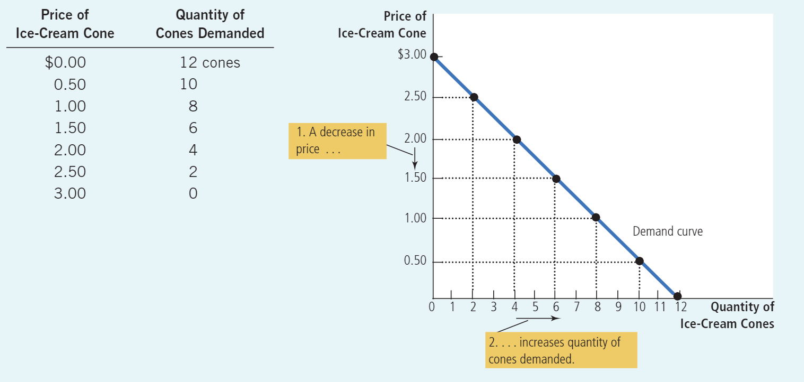
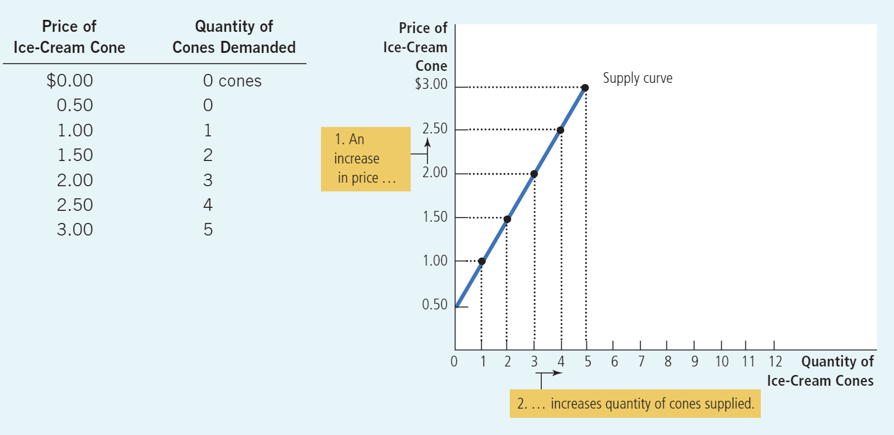
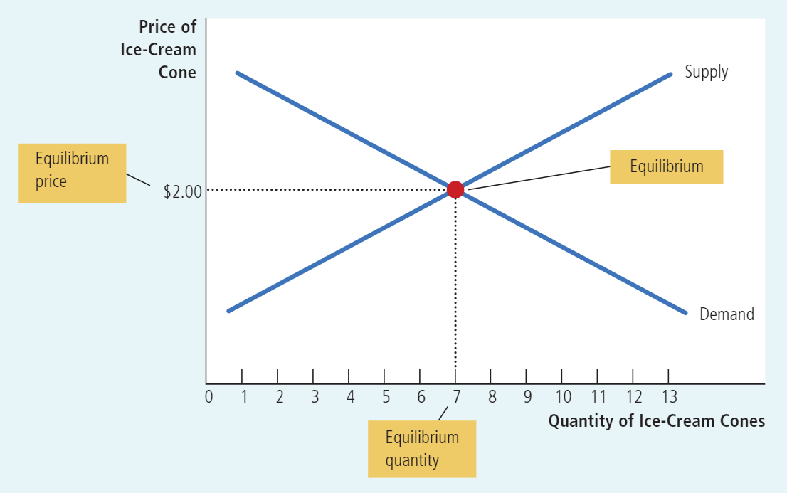

# Chapter 1
## Ten Principles of Economics
### How People Make Decisions
#### Principle 1: People Face Trade-offs
Consider parents deciding how to spend their family income. They can buy  
food, clothing, or a family vacation. Or they can save some of the family income  
for retirement or the children’s college education. When they choose to spend an extra dollar on one of these goods, they have one less dollar to spend on some other good.
When people are grouped into societies, they face different kinds of trade-offs. 
One classic trade-off is between “guns and butter.” The more a society spends on 
national defense (guns) to protect its shores from foreign aggressors, the less it can spend on consumer goods (butter) to raise the standard of living at home.

Nonetheless, people are likely to make good decisions only if they understand the options that are available to them.
#### Principle 2: The Cost of Something Is What You Give Up to Get It
**opportunity cost**
The opportunity cost of an item is what you give up to get that item.
#### Principle 3: Rational People Think at the Margin
A rational decision maker takes an action if and only if the marginal benefit of  
the action exceeds the marginal cost.
#### Principle 4: People Respond to Incentives
### How People Interact
#### Principle 5: Trade Can Make Everyone Better Off
#### Principle 6: Markets Are Usually a Good Way to  Organize Economic Activity
#### Principle 7: Governments Can Sometimes Improve Market Outcome
Market economies need institutions to enforce property rights so individuals can own and control scarce resources.

Most policies aim either to enlarge the economic pie or to change how the pie is divided.

Economists use the term market failure to refer to a situation in which the market on its own fails to produce an efficient allocation of resources. One possible cause of market failure is an externality, which is the impact of one person’s actions on the well-being of a bystander. The classic example of an externality is pollution. Another possible cause of market failure is market power, which refers to the ability of a single person or firm (or a small group) to unduly influence market prices.
### How the Economy as a Whole Works
#### Principle 8: A Country’s Standard of Living Depends on Its Ability to Produce Goods and Services
Countries’ productivity—that is, the amount of goods and services produced by each unit of labor input.

When thinking about how any policy will affect living standards, the key question is how it will affect our ability to produce goods and services.
#### Principle 9: Prices Rise When the Government Prints Too Much Money
What causes inflation? In almost all cases of large or persistent inflation, the  
culprit is growth in the quantity of money.
#### Principle 10: Society Faces a Short-Run Trade-off between Inflation and Unemployment

# Chapter 2
Assumptions can simplify the complex world and make it easier to understand. To study the effects of international trade, for example, we might assume that the world consists of only two countries and that each country produces only two goods. By considering a world with only two countries and two goods, we  
can focus our thinking on the essence of the problem.

Economists use different assumptions when studying the short-run and long-run effects of a policy.

Economists also use models to learn about the world, their models mostly consist of diagrams and equations.

All the models are built with assumptions. Just as a physicist begins the analysis of a falling marble by assuming away the existence of friction, economists assume away many details of the economy that are irrelevant to the question at hand. All models—in physics, biology, and economics—simplify reality to improve our understanding of it.

The field of economics is traditionally divided into two broad subfields. Microeconomics and Macroeconomics.
# Chapter 3
**absolute advantage**
Economists use the term absolute advantage when comparing the productivity of one person, firm, or nation to that of another. The producer that requires a smaller quantity of inputs to produce a good is said to have an absolute advantage in producing that good.

**comparative advantage**
Economists use the term comparative advantage when describing the opportu-  
nity costs faced by two producers. The producer who gives up less of other goods to produce Good X has the smaller opportunity cost of producing Good X and is said to have a comparative advantage in producing it.

**both parties gain from trade**
For both parties to gain from trade, the price at which they trade must lie between the two opportunity costs.
# Chapter 4
**What Is a Market?**  
A market is a group of buyers and sellers of a particular good or service.

**What Is Competition?**
Economists use the term competitive market to describe a market in which there are so many buyers and so many sellers that each has a negligible impact on the market price.

**perfectly competitive markets**
To reach this highest form of competition, a market must have two characteristics: (1) The goods offered for sale are all exactly the same, and (2) the buyers and sellers are so numerous that no single buyer or seller has any influence over the market price. Because buyers and sellers in perfectly competitive markets must accept the price the market determines, they are said to be price takers.

**monopoly**
Some markets have only one seller, and this seller sets the price. Such a seller is called a monopoly.

## Demand
**law of demand**
Other things being equal, when the price of a good rises, the quantity demanded of the good falls, and when the price falls, the quantity demanded rises.

**demand schedule and demand curve**
A table that shows the relationship between the price of a good and the quantity demanded, holding constant everything else that influences how much of the good consumers want to buy. The demand curve, which graphs the demand schedule.

**normal good**
If the demand for a good falls when income falls, the good is called a normal good.

**inferior good**
If the demand for a good rises when income falls, the good is called an inferior good. An example of an inferior good might be bus rides. As your income falls, you are less likely to buy a car or take a cab and more likely to ride a bus.

**substitutes**
When a fall in the price of one good reduces the demand for another good, the two goods are called substitutes. Substitutes are often pairs of goods that are used in place of each other, such as hot dogs and hamburgers, sweaters and sweatshirts, and cinema tickets and film streaming services.

**complements**
When a fall in the price of one good raises the demand for another good, the two goods are called complements. Complements are often pairs of goods that are used together, such as gasoline and automobiles, computers and software, and peanut butter and jelly.

**Expectations**
Your expectations about the future may affect your demand for a good or service today. If you expect to earn a higher income next month, you may choose to save less now and spend more of your current income buying ice cream. If you expect the price of ice cream to fall tomorrow, you may be less willing to buy an ice-cream cone at today’s price.

## Supply
**law of supply**
Other things being equal, when the price of a good rises, the quantity supplied of the good also rises, and when the price falls, the quantity supplied falls as well.

**supply schedule and supply curve**
A table that shows the relationship between the price of a good and the quantity supplied, holding constant everything else that influences how much of the good producers want to sell. The supply curve, which graphs the supply schedule.

**Expectations**
The amount of ice cream a firm supplies today may depend on its expectations about the future. For example, if a firm expects the price of ice cream to rise in the future, it will put some of its current production into storage and supply less to the market today.

## Supply and Demand Together
**equilibrium**
The point at which the supply and demand curves intersect.
**equilibrium price and equilibrium quantity**
The price at this intersection is called the equilibrium price, and the quantity is called the equilibrium quantity.
**market-clearing price**
The equilibrium price is sometimes called the market-clearing price because, at this price, everyone in the market has been satisfied: Buyers have bought all they want to buy, and sellers have sold all they want to sell.

**law of supply and demand**
The price of any good adjusts to bring the quantity supplied and quantity demanded for that good into balance.

# Chapter 5
**Elasticity**
Elasticity is a measure of how much buyers and sellers respond to changes in  
market conditions.

**price elasticity of demand**
The price elasticity of demand measures how much the quantity demanded responds to a change in price.
Economists compute the price elasticity of demand as the percentage change in the quantity demanded divided by the percentage change in the price.
**elastic**
Demand for a good is said to be *elastic* if the quantity demanded responds substantially to changes in the price.
Demand is considered elastic when the elasticity is greater than 1.
**inelastic**
Demand is said to be *inelastic* if the quantity demanded responds only slightly to changes in the price.
Demand is considered inelastic when the elasticity is less than 1.
**unit elasticity**
If the elasticity is exactly 1, demand is said to have *unit elasticity*.
# Chapter 6
**tax incidence**
The term **tax incidence** refers to how the burden of a tax is distributed among the various people who make up the economy.

A tax burden falls more heavily on the side of the market that is less elastic.
# Chapter 7
In any market, the equilibrium of supply and demand maximizes the total benefits received by all buyers and sellers combined.

**willingness to pay**
The maximum amount that a buyer will pay for a good.

**consumer surplus**
The amount a buyer is willing to pay for a good minus the amount the buyer actually pays for it. Consumer surplus measures the benefit buyers receive from participating in a market.

**producer surplus**
The amount a seller is paid minus the cost of production. Producer surplus measures the benefit sellers receive from participating in a market.

# Chapter 8
When a country allows trade and becomes an exporter of a good, domestic  
producers of the good are better off, and domestic consumers of the good are  
worse off.
When a country allows trade and becomes an importer of a good, domestic  
consumers of the good are better off, and domestic producers of the good are  
worse off.
# Chapter 10
Negative externalities lead markets to produce a larger quantity than is socially desirable. Positive externalities lead markets to produce a smaller quantity than  
is socially desirable. To remedy the problem, the government can internalize the externality by taxing goods that have negative externalities and subsidizing goods that have positive externalities.
# Chapter 12
When the government remedies an externality (such as air pollution), provides a public good (such as national defense), or regulates the use of a common resource (such as fish in a public lake), it can raise economic well-being.

# Chapter 13
**total revenue**
The amount that the firm receives for the sale of its output (cookies) is called total revenue.
**total cost**
The amount that the firm pays to buy inputs (flour, sugar, workers, ovens, and so forth) is called total cost.

**explicit costs**
input costs that require an outlay of money by the firm
**implicit costs**
input costs that do not require an outlay of money by the firm

**Average total cost and Marginal cost**
Average total cost tells us the cost of a typical unit of output if total cost is divided evenly over all the units produced. Marginal cost tells us the increase in total cost that arises from producing an additional unit of output.

  
The marginal-cost curve crosses the average-total-cost curve at its minimum.
# Chapter 14
In essence, because the firm’s marginal-cost curve determines the quantity of the good the firm is willing to supply at any price, the marginal-cost curve is also the competitive firm’s supply curve.
# Chapter 16
**concentration ratio**
The percentage of total output in the market supplied by the four largest firms.
# Chapter 17
**game theory**
The study of how people behave in strategic situations. By “strategic” we mean a situation in which a person, when choosing among alternative courses of action, must consider how others might respond to the action she takes.
# Chapter 18
A competitive, profit-maximizing firm hires workers up to the point at which  
the value of the marginal product of labor equals the wage.
# Chapter 19
Competitive markets contain a natural remedy for employer discrimination. The entry of firms that care only about profit tends to eliminate discriminatory wage  
differentials. These wage differentials persist in competitive markets only when customers are willing to pay to maintain the discriminatory practice or when the government mandates it.
# Chapter 23
**Gross domestic product (GDP)**
Gross domestic product (GDP) is the market value of all final goods and services produced within a country in a given period of time.

**The Components of GDP**
GDP (which we denote as Y) is divided into four components: consumption (C), investment (I), government purchases (G), and net exports (NX):
Y = C + I + G + NX

**Nominal GDP and Real GDP**
Nominal GDP uses current prices to place a value on the economy’s production of goods and services. Real GDP uses constant base-year prices to place a value on the economy’s production of goods and services.

**GDP deflator**
The GDP deflator measures the current level of prices relative to the level of  
prices in the base year.
# Chapter 24
**Consumer price index (CPI)**
The consumer price index (CPI) is a measure of the overall cost of the goods and  services bought by a typical consumer.
# Chapter 26
For the economy as a whole, saving must be equal to investment.

  
If a reform of the tax laws encouraged greater saving, the result would be lower interest rates and greater investment.

If a reform of the tax laws encouraged greater investment, the result would be higher interest rates and greater saving.

When the government reduces national saving by running a budget deficit, the interest rate rises and investment falls.

A budget surplus increases the supply of loanable funds, reduces the interest  
rate, and stimulates investment.
# Chapter 29
If banks hold all deposits in reserve, banks do not influence the supply of money.

When banks hold only a fraction of deposits in reserve, the banking system creates money.

The money multiplier is the reciprocal of the reserve ratio.

The higher the reserve ratio, the less of each deposit banks loan out, and the  
smaller the money multiplier.

The purchase of government bonds increases the money supply, and the sale of  
government bonds decreases the money supply.

Open-market purchases lower the federal funds rate, and open-market sales raise the federal funds rate.

A decrease in the target for the federal funds rate means an expansion in the money supply.
# Chapter 30
In the long run, money supply and money demand are brought into equilibrium by the overall level of prices.
# Chapter 31
According to the theory of purchasing-power parity, the nominal exchange rate between the currencies of two countries must reflect the price levels in those countries.

When the central bank prints large quantities of money, that money loses value both in terms of the goods and services it can buy and in terms of the amount of other currencies it can buy.
# Chapter 32
In an open economy, government budget deficits raise real interest rates, crowd out domestic investment, cause the currency to appreciate, and push the trade balance toward deficit.

Trade policies do not affect the trade balance.

Capital flight from Mexico increases Mexican interest rates and decreases the value of the Mexican peso in the market for foreign-currency exchange.
# Chapter 33
An increase in the expected price level reduces the quantity of goods and services supplied and shifts the short-run aggregate-supply curve to the left. A decrease in the expected price level raises the quantity of goods and services supplied and shifts the short-run aggregate-supply curve to the right.
# Chapter 34
For the U.S. economy, the most important reason for the downward slope of the aggregate-demand curve is the interest-rate effect.

When the Fed increases the money supply, it lowers the interest rate and increases the quantity of goods and services demanded for any given price level, shifting the aggregate-demand curve to the right.

Monetary policy can be described either in terms of the money supply or in terms of the interest rate.
# Chapter 35
